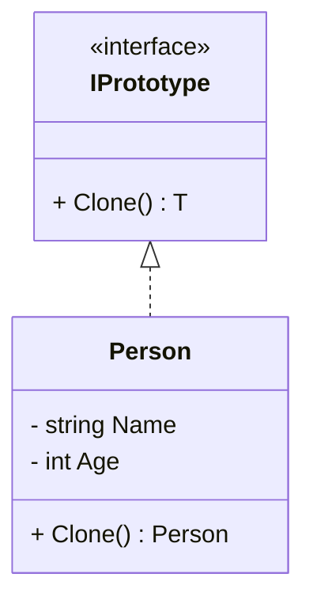
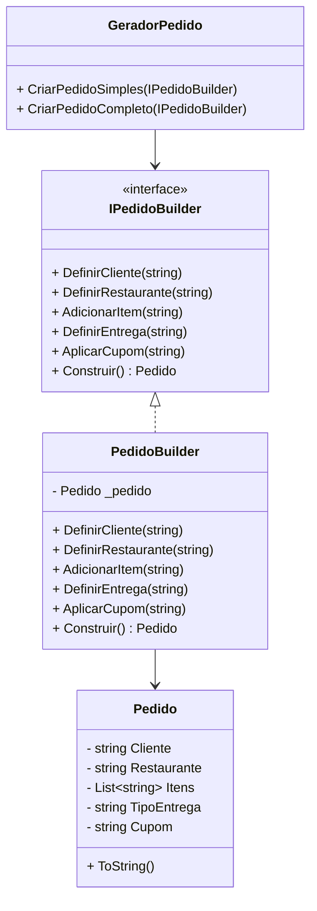
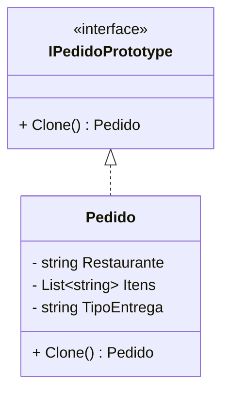
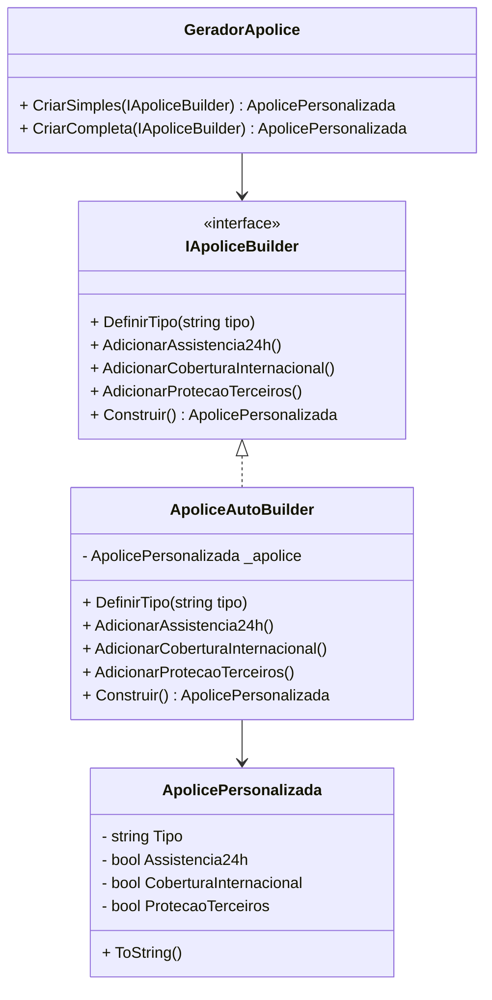
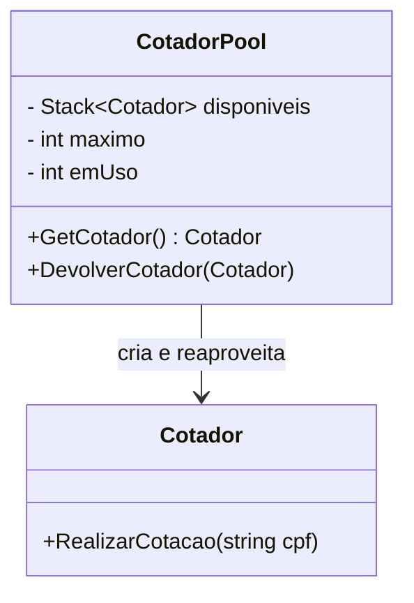

```mermaid
classDiagram
    class Sandwich {
        - string Bread
        - string Protein
        - string Salad
        + ToString()
    }

    class ISandwichBuilder {
        <<interface>>
        + SetBread()
        + SetProtein()
        + SetSalad()
        + GetResult() Sandwich
    }

    class VeganSandwichBuilder {
        - Sandwich _sandwich
        + SetBread()
        + SetProtein()
        + SetSalad()
        + GetResult() Sandwich
    }

    class SandwichDirector {
        + Construct(ISandwichBuilder builder)
    }

    ISandwichBuilder <|.. VeganSandwichBuilder
    VeganSandwichBuilder --> Sandwich
    SandwichDirector --> ISandwichBuilder
```

## 🧠 **Aula: Padrões de Projeto Criacionais (Continuação) – Builder e Prototype**

### 🎯 **Objetivos da Aula**

* Compreender o propósito dos padrões criacionais no design de software.
* Aplicar os padrões Builder e Prototype com exemplos práticos.
* Avaliar vantagens, desvantagens e quando usar cada padrão.

---

## 🕑 **Duração Total: 2 horas**

| Tempo       | Atividade                                        |
| ----------- | ------------------------------------------------ |
| 0–10 min    | Introdução aos Padrões Criacionais               |
| 10–45 min   | Padrão Builder – Conceito, Exemplo e Exercício   |
| 45–80 min   | Padrão Prototype – Conceito, Exemplo e Exercício |
| 80–110 min  | Análise de trade-offs e comparações práticas     |
| 110–120 min | Encerramento, dúvidas e insights                 |

---

## 🧩 **1. Introdução aos Padrões Criacionais (10 min)**

**Conceito geral:**

* Padrões criacionais tratam da **instanciação de objetos**, encapsulando o processo de criação.
* Objetivo: **reduzir o acoplamento** entre o sistema e a forma como objetos são criados.

---

## 🔥 A dor real (por que isso existe?)

Sem padrões, acabamos com código assim:

```csharp
var order = new Order(a, b, c, d, e, f, g, h...);
```

👉 Difícil de ler
👉 Difícil de manter
👉 Fácil de quebrar


**Padrões mais comuns:**

* Singleton
* Factory Method
* Abstract Factory
* Builder
* Prototype

### Revisão rápida:

| Padrão               | Descrição rápida            |
| -------------------- | --------------------------- |
| **Singleton**        | Uma única instância global  |
| **Factory Method**   | Subclasses decidem o objeto |
| **Abstract Factory** | Famílias de objetos         |
| **Builder**          | Construção passo a passo    |
| **Prototype**        | Clonagem de objetos         |
| **Object Pool**      | Reutilização de instâncias  |


---

## 🏗️ **2. Padrão Builder (35 min)**

### 📘 Conceito:

* Separação da construção de um objeto complexo da sua representação.
* Permite criar diferentes versões do mesmo objeto..


#### 🔥 Problema real

Construtores com muitos parâmetros:

```csharp
    new Order(cliente, itens, endereco, cupom, tipoEntrega, pagamento...);
```

### 🍔 Exemplo simples (didático):

```csharp
// Produto final
class Sandwich {
    public string Bread { get; set; }
    public string Protein { get; set; }
    public string Salad { get; set; }

    public override string ToString() =>
        $"Sanduíche com {Protein}, pão {Bread} e salada {Salad}";
}

// Builder
interface ISandwichBuilder {
    void SetBread();
    void SetProtein();
    void SetSalad();
    Sandwich GetResult();
}
```

#### Versão antiga, usando Director

```csharp
// Concrete Builder versão antiga
class VeganSandwichBuilder : ISandwichBuilder {
    private Sandwich _sandwich = new Sandwich();
    public void SetBread() => _sandwich.Bread = "Integral";
    public void SetProtein() => _sandwich.Protein = "Tofu";
    public void SetSalad() => _sandwich.Salad = "Alface e tomate";
    public Sandwich GetResult() => _sandwich;
}

// Director
class SandwichDirector {
    public void Construct(ISandwichBuilder builder) {
        builder.SetBread();
        builder.SetProtein();
        builder.SetSalad();
    }
}
```

#### Builder Moderno (Fluent API)
```csharp
var sandwich = new SandwichBuilder()
    .WithBread("Integral")
    .WithProtein("Tofu")
    .WithSalad("Alface")
    .Build();

var order = new OrderBuilder()
    .ForCustomer("João")
    .FromRestaurant("Pizza Place")
    .AddItem("Pizza Margherita")
    .WithDelivery("Express")
    .WithCoupon("FOOD10")
    .Build();
```





### 💡 Vantagens:

* Modularidade na construção de objetos.
* Facilita a criação de representações diferentes de um mesmo objeto.
* Código mais legível
* Construção flexível
* Evita construtores gigantes

### ❗ Desvantagens:

* Mais classes e complexidade.
* Pode ser overkill para objetos simples.

### 👨‍🏫 Atividade:

> Criar:
> 1. Builder para pedido do FoodNow
> 2. Builder para apólice

---

## 🧬 **3. Padrão Prototype (35 min)**

### 📘 Conceito:

* Cria novos objetos copiando uma instância existente.
* Útil quando a criação de um objeto é custosa (por performance ou complexidade).

### 🧪 Exemplo prático (C#):

```csharp
interface IPrototype<T> {
    T Clone();
}

class Person : IPrototype<Person> {
    public string Name { get; set; }
    public int Age { get; set; }

    public Person Clone() => (Person)this.MemberwiseClone();
}
```
Diagrama:



🚚 Exemplo — FoodNow

```csharp
var newOrder = lastOrder.Clone();

var apoliceNova = apolicePadrao.Clone();
```


### 💡 Vantagens:

* Reduz custo de criação de objetos complexos.
* Evita código de inicialização repetido.

### ❗ Desvantagens:

* Exige atenção com **deep copy** vs **shallow copy**.
* Pode ser difícil manter clones se a hierarquia for grande.

### 👨‍🏫 Atividade:

> Clonar:
> 1. Pedido FoodNow
> 2. Apolice

---

## ⚖️ **4. Análise de Trade-offs e Aplicações Práticas (30 min)**

### 🔍 Comparação entre Builder e Prototype:

| Critério         | Builder                                       | Prototype                         |
| ---------------- | --------------------------------------------- | --------------------------------- |
| Uso principal    | Construção passo a passo de objetos complexos | Cópia de objetos existentes       |
| Complexidade     | Média/Alta                                    | Baixa/Média                       |
| Flexibilidade    | Alta                                          | Média                             |
| Custo de criação | Irrelevante                                   | Alto (prototype é vantajoso)      |
| Quando usar      | Objetos com muitas variações                  | Objetos com inicialização custosa |

### 🌍 Aplicações práticas:

* **Builder**: Criação de relatórios PDF, configuração de UI, workflows de pipeline.
* **Prototype**: Jogos (clonar inimigos), documentos com templates, IA (clonagem de agentes).

---

### Object Pool (Bônus)

📘 Conceito

Reutilizar objetos ao invés de recriar.

⚠️ Cuidados
Thread safety
Não usar para objetos leves
🚚 FoodNow
Pool de conexões de pagamento
📚 6. Encerramento
✔️ Recapitulando
Builder → construção
Prototype → clonagem
Object Pool → reutilização


## 📚 **5. Encerramento e Dúvidas (10 min)**

* Quando usar cada padrão
* Vantagens e desvantagens

### ✔️ Recapitulando:

* Padrões criacionais reduzem o acoplamento da lógica de negócio com o modo de instanciar objetos.
* **Builder** é ideal para construções complexas e flexíveis.
* **Prototype** brilha em situações onde copiar objetos é mais eficiente do que construí-los do zero.


### 6. Adaptando os exemplos ao caso de uso do FoodNow

<details>
<summary>Exemplos FoodNow</summary>

## 🏗️ **Builder – Montagem personalizada de Pedido**

### 📘 Cenário

Na plataforma **FoodNow**, o cliente pode montar um pedido com várias opções:

- itens do restaurante  
- tipo de entrega (normal, expressa)  
- cupons de desconto  
- observações (ex: “sem cebola”)  

---

### 🎯 Objetivo

Permitir construir um **Pedido** passo a passo com diferentes combinações.

---

### ✅ Exemplo em C#

```csharp
// Produto final
class Pedido {
    public string Cliente { get; set; }
    public string Restaurante { get; set; }
    public List<string> Itens { get; set; } = new();
    public string TipoEntrega { get; set; }
    public string Cupom { get; set; }

    public override string ToString() {
        return $"{Cliente} pediu {string.Join(", ", Itens)} de {Restaurante} " +
               $"(Entrega: {TipoEntrega}, Cupom: {Cupom})";
    }
}

// Builder
interface IPedidoBuilder {
    void DefinirCliente(string cliente);
    void DefinirRestaurante(string restaurante);
    void AdicionarItem(string item);
    void DefinirEntrega(string tipo);
    void AplicarCupom(string cupom);
    Pedido Construir();
}

// Implementação concreta
class PedidoBuilder : IPedidoBuilder {
    private Pedido _pedido = new Pedido();

    public void DefinirCliente(string cliente) => _pedido.Cliente = cliente;
    public void DefinirRestaurante(string restaurante) => _pedido.Restaurante = restaurante;
    public void AdicionarItem(string item) => _pedido.Itens.Add(item);
    public void DefinirEntrega(string tipo) => _pedido.TipoEntrega = tipo;
    public void AplicarCupom(string cupom) => _pedido.Cupom = cupom;

    public Pedido Construir() => _pedido;
}

// Diretor
class GeradorPedido {
    public Pedido CriarPedidoSimples(IPedidoBuilder builder) {
        builder.DefinirCliente("João");
        builder.DefinirRestaurante("Pizza Place");
        builder.AdicionarItem("Pizza Margherita");
        builder.DefinirEntrega("Normal");
        return builder.Construir();
    }

    public Pedido CriarPedidoCompleto(IPedidoBuilder builder) {
        builder.DefinirCliente("João");
        builder.DefinirRestaurante("Pizza Place");
        builder.AdicionarItem("Pizza Margherita");
        builder.AdicionarItem("Refrigerante");
        builder.DefinirEntrega("Expressa");
        builder.AplicarCupom("FOOD10");
        return builder.Construir();
    }
}
````

---



---

## 🧬 **Prototype – Clonagem de Pedido (Repetir Pedido)**

### 📘 Cenário

No FoodNow, o cliente pode clicar em:

👉 **“Repetir pedido”**

---

### 🎯 Objetivo

Evitar recriar pedidos do zero — **clonar e ajustar rapidamente**.

---

### ✅ Exemplo em C#

```csharp
// Interface Prototype
interface IPedidoPrototype {
    Pedido Clone();
}

// Classe concreta
class Pedido : IPedidoPrototype {
    public string Restaurante { get; set; }
    public List<string> Itens { get; set; }
    public string TipoEntrega { get; set; }

    public Pedido Clone() {
        return new Pedido {
            Restaurante = this.Restaurante,
            Itens = new List<string>(this.Itens), // Deep copy da lista
            TipoEntrega = this.TipoEntrega
        };
    }
}
```

---

### 🧪 Uso prático

```csharp
// Pedido anterior
var pedidoAnterior = new Pedido {
    Restaurante = "Pizza Place",
    Itens = new List<string> { "Pizza", "Refrigerante" },
    TipoEntrega = "Normal"
};

// Cliente repete o pedido
var novoPedido = pedidoAnterior.Clone();
novoPedido.TipoEntrega = "Expressa"; // customização

Console.WriteLine($"Novo pedido: {novoPedido.Restaurante}");
```

---



---

## 🧠 Quando usar no FoodNow?

| Padrão        | Quando usar                                                     |
| ------------- | --------------------------------------------------------------- |
| **Builder**   | Quando o cliente monta o pedido passo a passo com várias opções |
| **Prototype** | Quando o cliente deseja repetir pedidos anteriores rapidamente  |

</details>


<details>
<summary>Exemplos Seguradora</summary>

#### 🏗️ **Builder – Montagem personalizada de Apólice**

##### 📘 Cenário:

A seguradora oferece **apólices personalizadas**, onde o cliente pode escolher coberturas adicionais (assistência 24h, cobertura internacional, proteção para terceiros, etc).

---

##### 🎯 Objetivo:

Permitir construir **objetos Apolice** passo a passo com diferentes combinações de coberturas.

##### ✅ Exemplo em C#:


```csharp
// Produto final
class ApolicePersonalizada {
    public string Tipo { get; set; }
    public bool Assistencia24h { get; set; }
    public bool CoberturaInternacional { get; set; }
    public bool ProtecaoTerceiros { get; set; }

    public override string ToString() {
        return $"{Tipo}: " +
               $"Assistência 24h: {Assistencia24h}, " +
               $"Internacional: {CoberturaInternacional}, " +
               $"Proteção a terceiros: {ProtecaoTerceiros}";
    }
}

// Builder
interface IApoliceBuilder {
    void DefinirTipo(string tipo);
    void AdicionarAssistencia24h();
    void AdicionarCoberturaInternacional();
    void AdicionarProtecaoTerceiros();
    ApolicePersonalizada Construir();
}

// Implementação concreta
class ApoliceAutoBuilder : IApoliceBuilder {
    private ApolicePersonalizada _apolice = new ApolicePersonalizada();

    public void DefinirTipo(string tipo) => _apolice.Tipo = tipo;
    public void AdicionarAssistencia24h() => _apolice.Assistencia24h = true;
    public void AdicionarCoberturaInternacional() => _apolice.CoberturaInternacional = true;
    public void AdicionarProtecaoTerceiros() => _apolice.ProtecaoTerceiros = true;

    public ApolicePersonalizada Construir() => _apolice;
}

// Diretor
class GeradorApolice {
    public ApolicePersonalizada CriarSimples(IApoliceBuilder builder) {
        builder.DefinirTipo("Auto Simples");
        builder.AdicionarAssistencia24h();
        return builder.Construir();
    }

    public ApolicePersonalizada CriarCompleta(IApoliceBuilder builder) {
        builder.DefinirTipo("Auto Completa");
        builder.AdicionarAssistencia24h();
        builder.AdicionarCoberturaInternacional();
        builder.AdicionarProtecaoTerceiros();
        return builder.Construir();
    }
}
```



---

#### 🧬 **Prototype – Clonagem de Apólice padrão (Template)**

##### 📘 Cenário:

Clientes da seguradora escolhem uma **apólice padrão como base**, e depois fazem pequenas customizações.

---

##### 🎯 Objetivo:

Evitar reconstruir apólices complexas do zero — clone e personalize.

##### ✅ Exemplo em C#:

```csharp
// Interface Prototype
interface IApolicePrototype {
    Apolice Clone();
}

// Classe concreta
class Apolice : IApolicePrototype {
    public string Tipo { get; set; }
    public string Cobertura { get; set; }
    public decimal ValorMensal { get; set; }

    public Apolice Clone() => (Apolice)this.MemberwiseClone();
}
```

##### 🧪 Uso prático:

```csharp
// Criando uma apólice padrão
var padraoVida = new Apolice {
    Tipo = "Vida Standard",
    Cobertura = "Hospitalar + Funeral",
    ValorMensal = 150.00m
};

// Clonando para personalização
var apoliceJoao = padraoVida.Clone();
apoliceJoao.ValorMensal = 170.00m; // customização leve

Console.WriteLine($"Apólice João: {apoliceJoao.Tipo}, {apoliceJoao.Cobertura}, {apoliceJoao.ValorMensal}");
```

```mermaid

```
classDiagram
    class IApolicePrototype {
        <<interface>>
        + Clone() Apolice
    }

    class Apolice {
        - string Tipo
        - string Cobertura
        - decimal ValorMensal
        + Clone() Apolice
    }

    IApolicePrototype <|.. Apolice
---

#### 🧠 Quando usar na seguradora?

| Padrão        | Quando usar                                                                         |
| ------------- | ----------------------------------------------------------------------------------- |
| **Builder**   | Quando o cliente **monta passo a passo** uma apólice com várias opções flexíveis    |
| **Prototype** | Quando você tem apólices padrão (templates) e quer **clonar e adaptar** rapidamente |


</details>


### 7. Referências:

* https://sourcemaking.com/design_patterns/creational_patterns


<details>
<summary>Bônus - Object Pool</summary>

### 8. Bônus - Object Pool

O padrão **Object Pool**, é menos famoso que os outros padrões criacionais, mas **muito útil em contextos de alto desempenho** — inclusive pode ser relevante numa seguradora com sistemas que fazem muitas chamadas externas ou processam grandes volumes de dados.

---

## 🏊‍♂️ **Padrão Criacional: Object Pool**

### 🧠 **O que é?**

O **Object Pool** (ou **pool de objetos**) é um padrão criacional que **mantém um conjunto de objetos prontos para uso**, reaproveitando instâncias em vez de criar e destruir objetos repetidamente.


---

### 💡 **Para que serve?**

* Evita **criação/destruição frequente** de objetos caros (por exemplo, conexões de banco, chamadas a APIs externas, ou processadores de XMLs complexos).
* Controla o número máximo de instâncias vivas (importante para recursos limitados).
* Garante **melhor desempenho e menor uso de memória**.

---

### 🏦 **Exemplo em contexto de seguradora:**

Imagine um serviço de cotação que consulta um sistema legado, e a criação de cada cliente para envio consome muita memória.

Você pode manter um pool de **"cotadores"** reaproveitáveis:

---

### ✅ Exemplo em C#:

```csharp
class Cotador {
    public void RealizarCotacao(string cpf) {
        Console.WriteLine($"Cotações em execução para: {cpf}");
        // Simula processamento pesado
        Thread.Sleep(1000);
    }
}

class CotadorPool {
    private readonly Stack<Cotador> _disponiveis = new();
    private readonly int _maximo;
    private int _emUso = 0;

    public CotadorPool(int maximo) => _maximo = maximo;

    public Cotador GetCotador() {
        if (_disponiveis.Count > 0) {
            _emUso++;
            return _disponiveis.Pop();
        }
        if (_emUso < _maximo) {
            _emUso++;
            return new Cotador();
        }
        throw new InvalidOperationException("Nenhum cotador disponível no pool.");
    }

    public void DevolverCotador(Cotador cotador) {
        _disponiveis.Push(cotador);
        _emUso--;
    }
}
```

---

### 🌀 Uso:

```csharp
var pool = new CotadorPool(2);

try {
    var cotador1 = pool.GetCotador();
    cotador1.RealizarCotacao("123.456.789-00");
    pool.DevolverCotador(cotador1);

    var cotador2 = pool.GetCotador();
    cotador2.RealizarCotacao("111.222.333-44");
    pool.DevolverCotador(cotador2);
}
catch (Exception ex) {
    Console.WriteLine(ex.Message);
}
```

---

## ✅ **Vantagens**

| ✅ Benefícios                              |
| ----------------------------------------- |
| Reduz o custo de criação de objetos caros |
| Controla número de instâncias ativas      |
| Melhora desempenho e uso de memória       |

---

## ⚠️ **Desvantagens**

| ⚠️ Cuidados                                      |
| ------------------------------------------------ |
| Complexidade de gerenciamento do pool            |
| Concorrência (thread safety pode ser necessária) |
| Não é útil para objetos leves                    |

---

## 📊 Quando usar na seguradora?

| Situação                               | Use Object Pool? |
| -------------------------------------- | ---------------- |
| Cotadores que acessam sistemas legados | ✅ Sim            |
| Parsers de grandes XMLs de propostas   | ✅ Sim            |
| Objetos simples (ex: DTOs)             | ❌ Não            |
| Conexões com APIs externas limitadas   | ✅ Sim            |

---




O **Object Pool** é um padrão de criação que **mantém um conjunto de objetos prontos para uso**, evitando o custo de criação e destruição repetida de instâncias (muito útil para objetos "caros", como conexões de banco, threads ou conexões de rede).


Essa imagem mostra a estrutura de funcionamento de uma **pilha (stack)** com operações básicas de `push` (inserção) e `pop` (remoção). No contexto de **design patterns**, mais especificamente do padrão **Object Pool**, ela pode ser usada para **ilustrar como objetos são gerenciados de forma reutilizável**.

---

### Relação com a imagem:

Vamos mapear a imagem com o comportamento do **Object Pool**:

1. **Empty Stack = Pool vazio**

   * No início, não há objetos no pool.

2. **Push 1, 2, 3 = Objetos sendo adicionados ao pool**

   * O método `release()` (ou `returnObject()`) está sendo chamado: um objeto que terminou seu uso volta ao pool.
   * Cada `push` representa o retorno de um objeto para o pool, ficando disponível para ser reutilizado.

3. **Pop = Objeto sendo retirado do pool para uso**

   * A operação `pop()` representa o método `get()` do Object Pool: um objeto é retirado da pilha para uso pelo sistema.
   * Repare que o último objeto inserido (3) é o primeiro a ser reutilizado – isso representa uma **política LIFO (Last In, First Out)**, que pode ser usada em pools mais simples.

---

### Conclusão

Essa imagem, embora represente uma **estrutura de dados stack**, serve bem como uma **analogia para o funcionamento básico de um Object Pool**, mostrando que:

* Objetos **não são destruídos**, mas **armazenados para reutilização**.
* Operações de `push` representam **devolver objetos ao pool**.
* Operações de `pop` representam **obter objetos do pool**.
* Isso ajuda a **otimizar o desempenho**, especialmente em sistemas com alta demanda de instanciamento de objetos.

</details>

---
  > © MoOngy 2026 | Este repositório é parte do programa de formação contínua em Engenharia de Software.
