## 🎓 Aula: Padrões de Projeto Estruturais – Adapter, Bridge e Composite

**Público-alvo**: Desenvolvedores júnior/intermediários
**Duração**: 2 horas
**Pré-requisitos**: Conhecimentos básicos de orientação a objetos (herança, composição, interfaces)

---

### 📘 Objetivos da Aula

* Compreender o propósito dos padrões estruturais no design de software
* Estudar em detalhe os padrões Adapter, Bridge e Composite
* Aplicar cada padrão em um exemplo prático
* Refletir sobre quando usar cada padrão no dia a dia

---

## 🧭 Roteiro da Aula (120 minutos)

| Tempo       | Atividade                                         |
| ----------- | ------------------------------------------------- |
| 0–10 min    | Introdução aos padrões estruturais                |
| 10–35 min   | **Adapter** – Teoria e prática                    |
| 35–60 min   | **Bridge** – Teoria e prática                     |
| 60–65 min   | Intervalo rápido                                  |
| 65–95 min   | **Composite** – Teoria e prática                  |
| 95–115 min  | Desafio prático (mini projeto com um dos padrões) |
| 115–120 min | Encerramento e dúvidas                            |

---
## 🏗️ Parte 0: Explicando para leigos

### 🏗️ O que são padrões estruturais?

Padrões estruturais são como **jeitos esperto de montar as peças do seu código**, para deixá-lo mais forte, flexível e fácil de trocar partes se precisar.

A página cita esses padrões: **Adapter**, **Bridge**, **Composite**, **Decorator**, **Facade**, **Flyweight**, **Proxy** ([sourcemaking.com][1]).

---

### 1. Adapter (Adaptador)

**O que faz:** conecta duas coisas que não falam a mesma “língua”.

**Analogia:** você tem um brinquedo que só funciona com pilhas redondas, mas só tem pilhas quadradas. Use um adaptador pra encaixar.

**No código:** um objeto com formato A entra num aparelho que espera formato B — o Adapter faz a “tradução” .

---

### 2. Bridge (Ponte)

**O que faz:** separa a parte que as pessoas usam da parte que faz o trabalho de verdade, pra poder mudar cada uma sem bagunçar a outra.

**Analogia:** controle remoto de TV. O controle (interface) é separado da TV (implementação). Você pode trocar a TV e usar o mesmo controle.

**No código:** você tem uma “interface” e várias “versões reais”. O bridge conecta os dois, separando responsabilidades .

---

### 3. Composite (Composto)

**O que faz:** trata objetos simples e grupos de objetos do mesmo jeito.

**Analogia:** no seu time de futebol, um jogador ou um grupo de jogadores pode correr juntos. Você dá o mesmo comando pra um único ou pro grupo.

**No código:** tanto um objeto sozinho (folha) quanto um grupo de objetos (composto) respondem de forma parecida .

---

### 4. Decorator (Decorador)

**O que faz:** adiciona funcionalidades extras sem mudar o objeto original.

**Analogia:** um hambúrguer simples. Se você coloca queijo, bacon e alface, você “decorou” o hambúrguer. O hambúrguer ainda é hambúrguer.

**No código:** você empilha camadas que acrescentam funções ao objeto original .

---

### 5. Facade (Fachada)

**O que faz:** esconde a bagunça interna por trás de uma interface simples.

**Analogia:** pra ligar sua TV, você aperta apenas um botão “Power”, sem se preocupar com como a energia passa pela TV, caixas, som, etc.

**No código:** um objeto só controla todo um sistema complexo por trás .

---

### 6. Flyweight (Puxa‑puxa)

**O que faz:** evita guardar respostas iguais várias vezes — compartilha entre vários objetos.

**Analogia:** você tem vários bonequinhos iguais, mas só um traje. Vários bonecos emprestam o mesmo traje, em vez de comprar vários.

**No código:** quando vários objetos são parecidos, eles usam o mesmo pedaço de memória para não desperdiçar .

---

### 7. Proxy (Procuração)

**O que faz:** é um substituto que controla o acesso a outro objeto.

**Analogia:** quando você quer conversar com uma pessoa muito ocupada, fala com o assistente dela primeiro. O assistente decide se passa a mensagem.

**No código:** o proxy implementa a mesma interface, mas pode bloquear, guardar logs ou atrasar o acesso ao objeto real .

---

#### 🧩 Resumo tabelado

| Padrão        | Faz...                                | Analogia                        |
| ------------- | ------------------------------------- | ------------------------------- |
| **Adapter**   | Traduz interfaces diferentes          | Transformador de pilhas         |
| **Bridge**    | Separa controle e implementação       | Controle remoto de TV           |
| **Composite** | Trata objetos únicos ou grupos igual  | Jogador solo ou time            |
| **Decorator** | Adiciona funções sem mudar o original | Queijo e bacon no hambúrguer    |
| **Facade**    | Simplifica sistemas complexos         | Botão Power da TV               |
| **Flyweight** | Compartilha coisas repetidas          | Traje usado por vários bonecos  |
| **Proxy**     | Controla acesso a algo                | Assistente da pessoa importante |


## 🧩 Parte 1: Introdução aos Padrões Estruturais (10 min)

**Conceito:**
Padrões estruturais lidam com a **composição de classes e objetos**, ajudando a formar estruturas maiores de maneira flexível e reutilizável.

**Padrões que veremos:**

* Adapter → Conversão de interfaces
* Bridge → Separação de abstração e implementação
* Composite → Hierarquias com comportamento uniforme

---

| Padrão           | Descrição rápida                                                                                                                                                        |
| ---------------- | ----------------------------------------------------------------------------------------------------------------------------------------------------------------------- |
| 🧩 **Adapter**   | Permite que interfaces incompatíveis trabalhem juntas, adaptando uma interface para outra esperada pelo cliente.                                                        |
| 🌉 **Bridge**    | Desacopla uma abstração da sua implementação, permitindo que ambas possam variar independentemente.                                                                     |
| 🌲 **Composite** | Compõe objetos em estruturas de árvore para representar hierarquias parte-todo, permitindo que clientes tratem objetos individuais e composições de forma uniforme.     |
| 🎭 **Decorator** | Adiciona responsabilidades adicionais a um objeto dinamicamente, sem alterar sua estrutura original.                                                                    |
| 🚪 **Facade**    | Fornece uma interface simplificada para um conjunto complexo de interfaces em um subsistema, facilitando o uso do sistema.                                              |
| 🪶 **Flyweight** | Usa compartilhamento para suportar grandes quantidades de objetos com eficiência, reduzindo uso de memória ao compartilhar estados comuns.                              |
| 🛡️ **Proxy**    | Fornece um substituto ou representante de outro objeto para controlar o acesso a ele, podendo adicionar funcionalidades extras como controle de acesso ou lazy loading. |


---

### 🧩 **Adapter** – "O Tradutor entre Sistemas"

Imagine que sua seguradora acabou de comprar uma empresa menor que tem um **sistema antigo de apólices**. Esse sistema fala um "idioma diferente" do sistema moderno que você já usa.

💬 O que acontece?
Os dois sistemas **não se entendem**. Um pede "CPF do cliente", o outro responde "Identificador Pessoal". Um quer XML, o outro fala JSON.

✅ Como o Adapter ajuda?
Ele é como um **intérprete** que fica no meio dos dois sistemas. Quando o sistema novo pede uma apólice, o Adapter traduz o pedido para o formato do sistema antigo, pega a resposta e **traduz de volta** para o novo.

📌 Exemplo simples:
O seu sistema moderno diz: “Quero os dados da apólice do João.”
O Adapter responde: “Claro, vou perguntar para o sistema antigo e devolver para você do jeitinho que entende.”

---

### 🌉 **Bridge** – "Escolha o Relatório e o Formato Separadamente"

Na seguradora, você tem **vários tipos de relatórios**, como:

* Relatório de **sinistro de carro**
* Relatório de **sinistro de casa**
* Relatório de **sinistro de saúde**

E você pode querer **exportar** esses relatórios em **formatos diferentes**:

* PDF para enviar ao cliente
* CSV para análises internas
* XML para órgãos reguladores
* JSON para APIs

💬 O problema:
Se você tivesse que fazer **um sistema diferente para cada combinação** (carro + PDF, carro + CSV, casa + PDF...), teria que criar um **monte de código duplicado**.

✅ Como o Bridge ajuda?
Ele permite que você **separe o tipo do relatório** do **formato de exportação**.
Você pode combinar qualquer tipo com qualquer formato **sem misturar os códigos**.

📌 Exemplo simples:
Pense numa **cafeteira** com cápsulas. Você escolhe **o sabor** (relatório) e **o copo** (formato). A cafeteira (Bridge) combina os dois e entrega o café.


---

## 🔌 Parte 2: Adapter (25 min)

### 🎯 Intenção:

Permitir que classes com interfaces incompatíveis trabalhem juntas.


### 📚 Exemplo conceitual:

```csharp
// Interface esperada
public interface ITarget {
    string Request();
}

// Classe existente com interface diferente
public class Adaptee {
    public string SpecificRequest() => "Requisição específica";
}

// Adapter
public class Adapter : ITarget {
    private readonly Adaptee _adaptee;
    public Adapter(Adaptee adaptee) => _adaptee = adaptee;

    public string Request() => _adaptee.SpecificRequest();
}
```

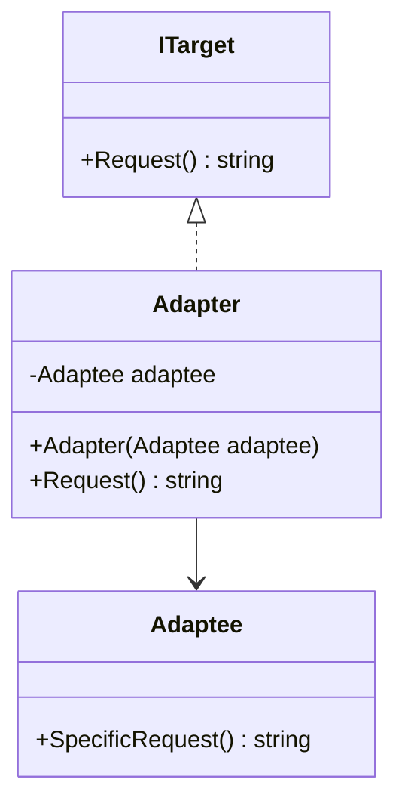

### 💡 Explicação:

* `ITarget` é a **interface esperada**.
* `Adaptee` é a **classe existente** com uma interface incompatível.
* `Adapter` **implementa** `ITarget` e **comunica-se** com `Adaptee` internamente.


### 💬 Discussão:

* Onde encontramos isso no mundo real? (ex: APIs externas, bibliotecas legadas)
* Diferença entre Object Adapter e Class Adapter


A diferença entre **Object Adapter** e **Class Adapter** está principalmente na forma como cada um implementa o **padrão Adapter**, que tem como objetivo permitir que duas interfaces incompatíveis trabalhem juntas. Ambos seguem o mesmo propósito, mas com abordagens diferentes:

---

### 🔌 **Object Adapter** (Adaptador por Composição)

* **Como funciona**: Usa **composição** — o adaptador mantém uma instância da classe que está sendo adaptada.
* **Estrutura**:

  * O adaptador **implementa a interface esperada** (target).
  * **Encapsula** um objeto da classe adaptada (adaptee).
  * Redireciona chamadas para o objeto interno.

#### ✅ Vantagens:

* Funciona mesmo que a classe adaptada não permita herança (ex: classes `final`).
* Pode adaptar várias subclasses de uma classe base.
* Mais flexível: pode adaptar vários adaptees diferentes, inclusive em tempo de execução.

#### ❌ Desvantagens:

* Um pouco mais verboso (precisa de delegação explícita).

#### 📦 Exemplo em C#:

```csharp
// Interface esperada
public interface IAlvo {
    void Solicitar();
}

// Classe existente com interface diferente
public class Adaptado {
    public void PedidoEspecifico() {
        Console.WriteLine("Pedido Específico");
    }
}

// Adaptador por composição
public class Adaptador : IAlvo {
    private Adaptado _adaptado = new Adaptado();

    public void Solicitar() {
        _adaptado.PedidoEspecifico(); // delega
    }
}
```

---

### 🧬 **Class Adapter** (Adaptador por Herança)

* **Como funciona**: Usa **herança múltipla** (ou interface + herança), ou seja, o adaptador **herda** da classe a ser adaptada e **implementa** a interface esperada.
* **Só é possível em linguagens que suportam herança múltipla ou interfaces junto com herança (como C++, mas não C# ou Java diretamente).**

#### ✅ Vantagens:

* Mais simples, com menos código (sem delegação).
* Boa performance (chamada direta via herança).

#### ❌ Desvantagens:

* **Menos flexível**: está fortemente acoplado à classe adaptada.
* Só funciona se você puder herdar da adaptee (não funciona com classes `final`).
* Você não pode adaptar múltiplos adaptees (por limitação da herança).

#### 📦 Exemplo em C++ (pois C# e Java não suportam herança múltipla de classes):

```cpp
class Alvo {
public:
    virtual void Solicitar() = 0;
};

class Adaptado {
public:
    void PedidoEspecifico() {
        std::cout << "Pedido Específico" << std::endl;
    }
};

// Adaptador por herança
class Adaptador : public Alvo, public Adaptado {
public:
    void Solicitar() override {
        PedidoEspecifico();
    }
};
```

---

### 📊 Resumo das Diferenças

| Aspecto                      | **Object Adapter**         | **Class Adapter**                      |
| ---------------------------- | -------------------------- | -------------------------------------- |
| Técnica usada                | Composição                 | Herança                                |
| Flexibilidade                | Alta                       | Baixa                                  |
| Acesso a métodos             | Apenas públicos do adaptee | Pode acessar métodos protegidos também |
| Pode adaptar várias classes? | Sim, via composição        | Não, só uma por vez                    |
| Suporte em Java/C#           | ✅ Sim                      | ❌ Não (por falta de herança múltipla)  |

---

### 🧩 **Object Adapter (por composição)**

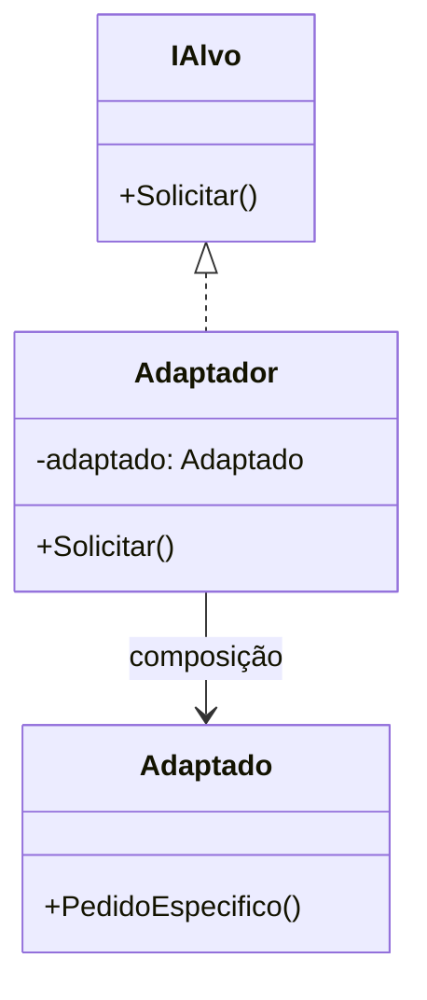

---

### 🧬 **Class Adapter (por herança)**

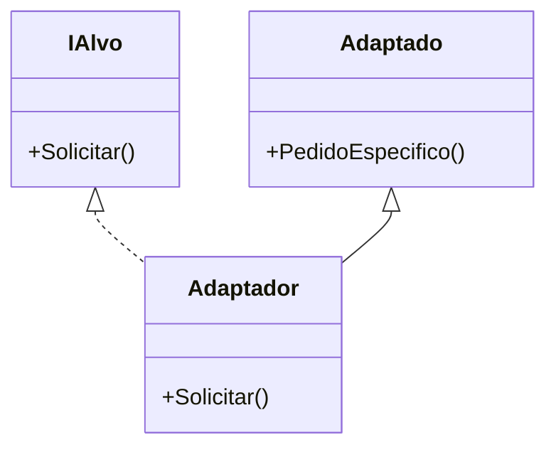

---

Esses diagramas ilustram claramente:

* No **Object Adapter**, a relação é por **composição** (`Adaptador --> Adaptado`).
* No **Class Adapter**, a relação é por **herança dupla** (`Adaptador` herda tanto de `IAlvo` quanto de `Adaptado`).


### 🛠️ Atividade rápida (5 min):

Transformar uma classe `JsonLogger` para se adaptar à interface `ILogger`.

---

## 🌉 Parte 3: Bridge (25 min)

### 🎯 Intenção:

Separar uma abstração de sua implementação para que as duas possam variar independentemente.

### 📚 Exemplo conceitual:

```csharp
// Implementor
public interface IRenderer {
    void Render(string shape);
}

// Concrete Implementors
public class VectorRenderer : IRenderer {
    public void Render(string shape) => Console.WriteLine($"Renderizando {shape} vetorialmente.");
}
public class RasterRenderer : IRenderer {
    public void Render(string shape) => Console.WriteLine($"Renderizando {shape} com pixels.");
}

// Abstraction
public abstract class Shape {
    protected IRenderer renderer;
    protected Shape(IRenderer renderer) => this.renderer = renderer;
    public abstract void Draw();
}

// Refined Abstraction
public class Circle : Shape {
    public Circle(IRenderer renderer) : base(renderer) { }
    public override void Draw() => renderer.Render("círculo");
}
```

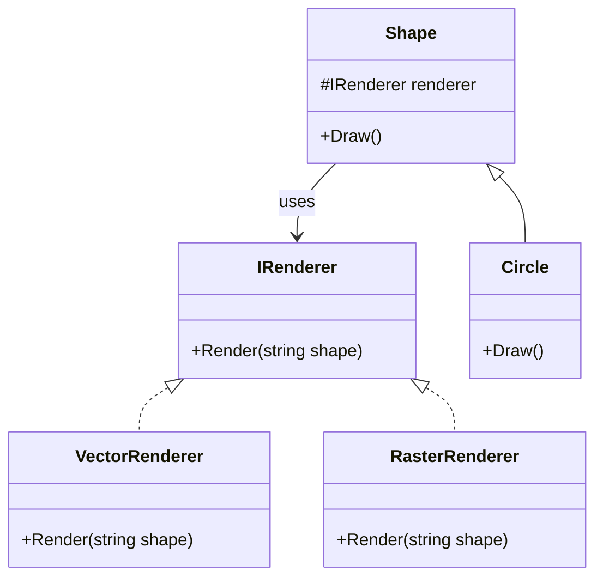

### 💡 Explicação:

* `IRenderer` é a **implementação** (interface).
* `VectorRenderer` e `RasterRenderer` são implementações concretas.
* `Shape` é a **abstração**.
* `Circle` é uma abstração refinada que depende da composição de `IRenderer`.


### 💬 Discussão:

* Quando usar Bridge em vez de herança?
* Flexibilidade com composição

### 🛠️ Atividade rápida (5 min):

Criar uma forma `Square` com ambos os renderizadores.

---

## 🌲 Parte 4: Composite (30 min)

### 🎯 Intenção:

Permitir tratar objetos individuais e composições de objetos de forma uniforme.

### 📚 Exemplo conceitual:

```csharp
// Component
public abstract class Graphic {
    public abstract void Draw();
}

// Leaf
public class Line : Graphic {
    public override void Draw() => Console.WriteLine("Desenha linha");
}

// Composite
public class Picture : Graphic {
    private List<Graphic> _children = new();
    public void Add(Graphic g) => _children.Add(g);

    public override void Draw() {
        Console.WriteLine("Desenhando figura composta:");
        foreach (var g in _children) g.Draw();
    }
}
```
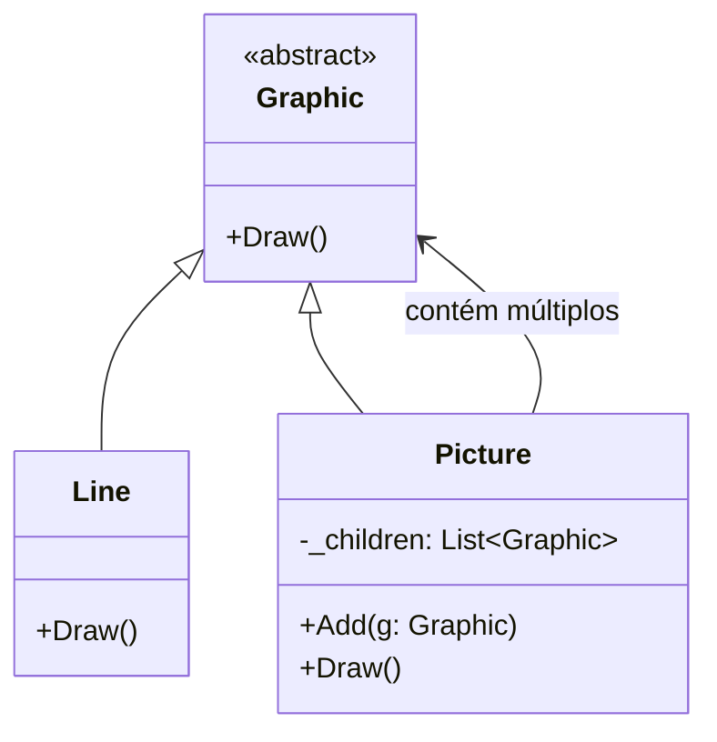

---

Esse diagrama representa:

* `Graphic` como componente abstrato.
* `Line` como **folha** (Leaf).
* `Picture` como **composite** que contém uma lista de `Graphic`.

### 💬 Discussão:

* Útil para representar hierarquias (menus, árvores, documentos)
* Perfeito para estruturas recursivas

### 🛠️ Atividade rápida (5 min):

Criar um `Menu` composto com submenus e itens.

---

## 💡 Parte 5: Desafio Prático (20 min)

### Desafio:

Você tem um sistema de notificação que envia mensagens via e-mail, SMS ou push notification. O cliente deseja poder agrupar notificações e disparar tudo com uma só chamada. Além disso, os provedores têm APIs diferentes.

**Objetivo:**
Usar os padrões discutidos para:

* Adaptar as APIs de envio
* Criar uma ponte entre o tipo de mensagem e o canal
* Compor múltiplas mensagens em uma estrutura

📦 Entregar uma estrutura que combine Adapter + Bridge + Composite (livre criatividade)

---

## 🏁 Encerramento (5 min)

* Recapitulação rápida dos três padrões
* Quando **não** usar esses padrões (overengineering)
* Dicas para estudar: livros como *Design Patterns: Elements of Reusable Object-Oriented Software* e repositórios no GitHub

---


## Bônus - Private Class Data

### Dados Privados da Classe (Private Class Data)

**Intenção**

* Controlar o acesso de escrita aos atributos da classe
* Separar os dados dos métodos que os utilizam
* Encapsular a inicialização dos dados da classe
* Fornecer um novo tipo de `final` — final após o construtor

**Problema**
Uma classe pode expor seus atributos (variáveis da classe) para manipulação mesmo quando essa manipulação não é mais desejável, por exemplo, após a construção do objeto. O uso do padrão de projeto *Private Class Data* previne essa manipulação indesejada.

Uma classe pode ter atributos mutáveis que devem ser definidos uma única vez e que não podem ser declarados como `final`. Usar esse padrão permite que esses atributos sejam configurados uma única vez.

A motivação para esse padrão vem do objetivo de proteger o estado da classe minimizando a visibilidade dos seus atributos (dados).

**Discussão**
O padrão *Private Class Data* busca reduzir a exposição dos atributos limitando sua visibilidade.

Ele reduz o número de atributos da classe encapsulando-os em um único objeto de dados. Isso permite que o designer da classe remova o privilégio de escrita dos atributos que devem ser configurados apenas durante a construção, mesmo para os métodos da própria classe.

**Estrutura**
O padrão *Private Class Data* resolve os problemas acima extraindo uma classe de dados para a classe alvo e dando à instância da classe alvo uma instância da classe de dados extraída.

**Esquema do Private Class Data**

**Lista de verificação**

* Criar uma classe de dados. Mover para essa classe todos os atributos que precisam ficar escondidos.
* Criar na classe principal uma instância da classe de dados.
* A classe principal deve inicializar a classe de dados por meio do construtor da classe de dados.
* Expor cada atributo (variável ou propriedade) da classe de dados por meio de um getter.
* Expor cada atributo que poderá ser alterado posteriormente por meio de um setter.

---

### Exemplo C\#

```csharp
// Classe de dados que encapsula os atributos privados
public class PersonData
{
    public string Name { get; private set; }
    public int Age { get; private set; }

    public PersonData(string name, int age)
    {
        Name = name;
        Age = age;
    }

    // Se quiser permitir alteração futura, expõe setter controlado
    public void UpdateAge(int newAge)
    {
        if (newAge > Age) Age = newAge;
    }
}

// Classe principal que usa PersonData para encapsular dados
public class Person
{
    private readonly PersonData _data;

    public Person(string name, int age)
    {
        _data = new PersonData(name, age);
    }

    public string Name => _data.Name;
    public int Age => _data.Age;

    public void HaveBirthday()
    {
        _data.UpdateAge(_data.Age + 1);
    }
}
```

---

### Diagrama Mermaid (Markdown)

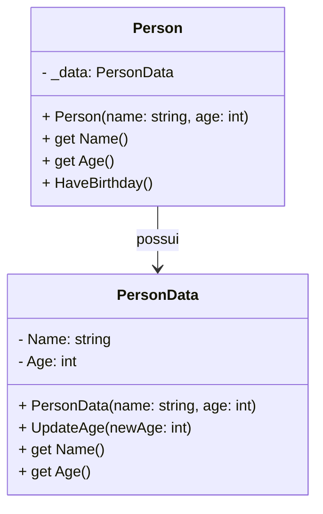

---

Esse exemplo mostra a **separação dos dados** em `PersonData`, protegendo os atributos, enquanto a classe `Person` oferece acesso controlado, limitando a mutabilidade.


## 📎 Materiais de Apoio 

https://sourcemaking.com/design_patterns/private_class_data 

<details>
<summary> Exemplos Seguradora </summary>

## Seguradora 

Aqui estão exemplos dos padrões estruturais **Adapter**, **Bridge**, **Composite** e **Private Class Data**, **adaptados para um contexto de seguradora**, com explicações e sugestões de uso real.

---

## 🧩 1. Adapter – Integração com sistema legado de apólices

### 🧠 Contexto:

A seguradora possui um sistema legado (`LegacyPolicyService`) que retorna os dados da apólice num formato antigo, mas o sistema moderno espera uma interface comum chamada `IPolicyService`.

### 🧱 Exemplo:

```csharp
// Interface moderna usada no novo sistema
public interface IPolicyService {
    PolicyDetails GetPolicy(string policyId);
}

// Sistema legado (interface diferente)
public class LegacyPolicyService {
    public string GetPolicyData(string id) {
        // retorna JSON string com dados da apólice
        return "{ \"policyNumber\": \"ABC123\" }";
    }
}

// Adapter
public class LegacyPolicyAdapter : IPolicyService {
    private readonly LegacyPolicyService _legacyService;

    public LegacyPolicyAdapter(LegacyPolicyService legacyService) {
        _legacyService = legacyService;
    }

    public PolicyDetails GetPolicy(string policyId) {
        var json = _legacyService.GetPolicyData(policyId);
        return JsonSerializer.Deserialize<PolicyDetails>(json);
    }
}
```


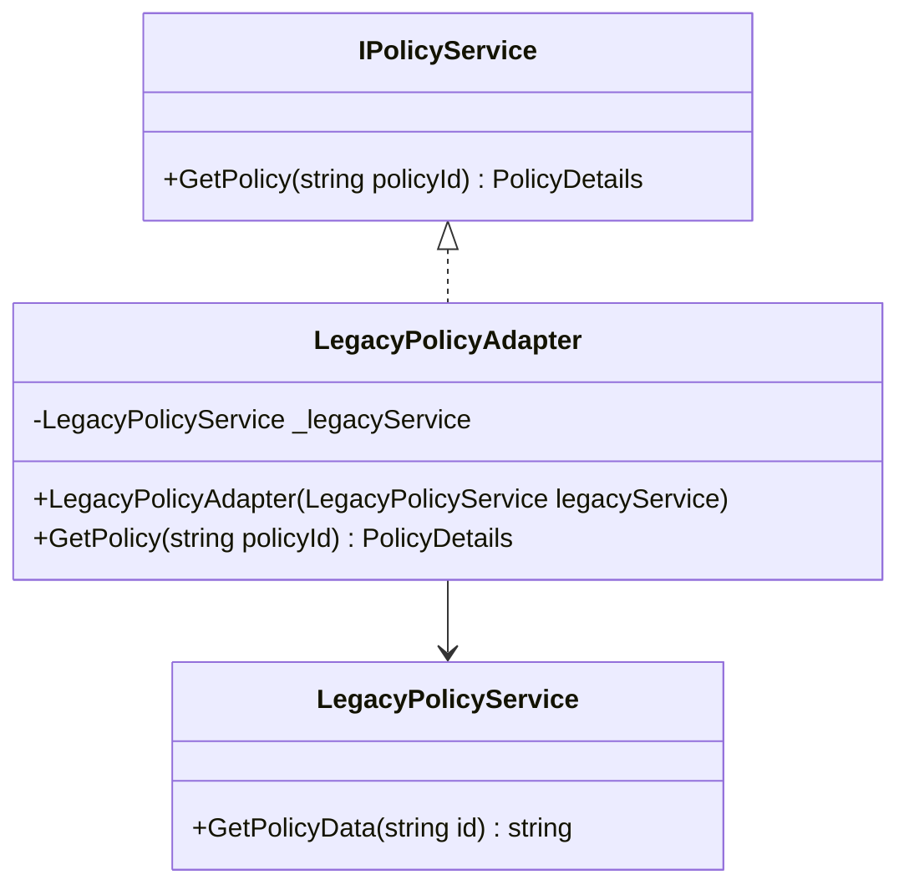

👉 **Uso real**: adaptar sistemas legados de cálculo de prêmio, validação de documentos ou emissão de apólices.

---

## 🌉 2. Bridge – Relatórios de sinistros com múltiplos formatos

### 🧠 Contexto:

Relatórios de sinistros podem variar por tipo (ex: residencial, automóvel, saúde) e precisam ser exportados em diferentes formatos (ex: PDF, CSV, XML).

### 🧱 Exemplo:

```csharp
// Implementor
public interface IReportExporter {
    void Export(string content);
}

// Concrete Implementors
public class PdfExporter : IReportExporter {
    public void Export(string content) => Console.WriteLine($"Exportando PDF: {content}");
}

public class CsvExporter : IReportExporter {
    public void Export(string content) => Console.WriteLine($"Exportando CSV: {content}");
}

// Abstraction
public abstract class ClaimReport {
    protected IReportExporter _exporter;
    public ClaimReport(IReportExporter exporter) => _exporter = exporter;
    public abstract void Generate();
}

// Refined Abstraction
public class AutoClaimReport : ClaimReport {
    public AutoClaimReport(IReportExporter exporter) : base(exporter) { }

    public override void Generate() {
        var content = "Relatório de sinistro automóvel";
        _exporter.Export(content);
    }
}
```


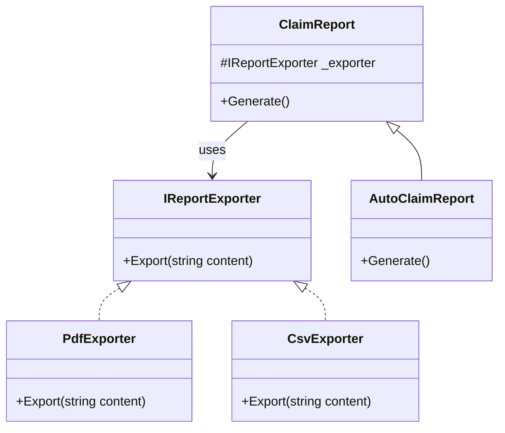


👉 **Uso real**: gerar relatórios ou documentos que precisam mudar de tipo ou formato sem acoplamento.

---

## 🌲 3. Composite – Estrutura de coberturas de um seguro

### 🧠 Contexto:

Um plano de seguro pode conter coberturas compostas: por exemplo, “Seguro Auto Completo” é composto por “Danos a Terceiros”, “Roubo”, “Incêndio”, etc.

### 🧱 Exemplo:

```csharp
// Component
public abstract class Coverage {
    public abstract decimal GetPremium();
}

// Leaf
public class FireCoverage : Coverage {
    public override decimal GetPremium() => 50m;
}

public class TheftCoverage : Coverage {
    public override decimal GetPremium() => 40m;
}

// Composite
public class CompositeCoverage : Coverage {
    private List<Coverage> _coverages = new();

    public void Add(Coverage coverage) => _coverages.Add(coverage);

    public override decimal GetPremium() =>
        _coverages.Sum(c => c.GetPremium());
}
```

```csharp
// Uso
var fullCoverage = new CompositeCoverage();
fullCoverage.Add(new FireCoverage());
fullCoverage.Add(new TheftCoverage());

Console.WriteLine($"Prêmio total: {fullCoverage.GetPremium()}"); // 90
```


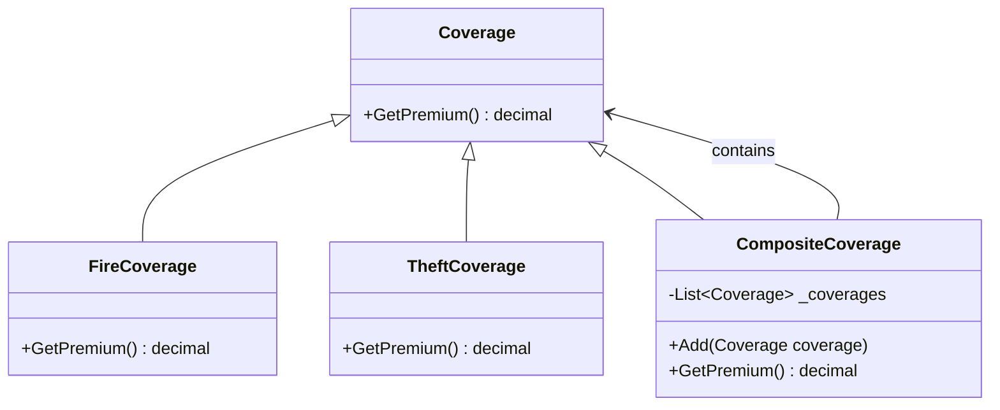


👉 **Uso real**: montar planos personalizáveis de seguros com composição dinâmica de coberturas.

---

## 🔐 4. Private Class Data – Proteção de dados sensíveis da apólice

### 🧠 Contexto:

A seguradora precisa proteger dados sensíveis (ex: valor da apólice, CPF, prêmio mensal) e garantir que esses dados não sejam modificados diretamente.

### 🧱 Exemplo:

```csharp
// Private class data
public class PolicyData {
    public string PolicyHolder { get; }
    public decimal Premium { get; }
    public string CPF { get; }

    public PolicyData(string holder, decimal premium, string cpf) {
        PolicyHolder = holder;
        Premium = premium;
        CPF = cpf;
    }
}

// Classe principal expõe apenas leitura
public class InsurancePolicy {
    private readonly PolicyData _data;

    public InsurancePolicy(string holder, decimal premium, string cpf) {
        _data = new PolicyData(holder, premium, cpf);
    }

    public string GetHolder() => _data.PolicyHolder;
    public decimal GetPremium() => _data.Premium;
    public string GetCPFMasked() => $"***.***.{_data.CPF[^3..]}";
}
```


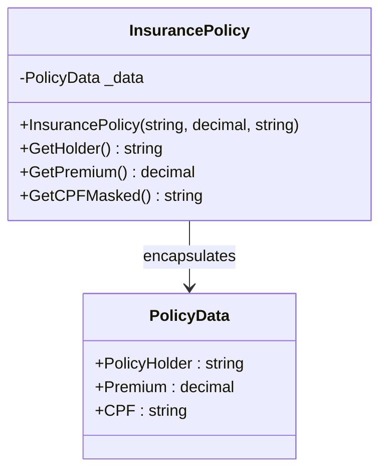


👉 **Uso real**: garantir **imutabilidade**, **encapsulamento forte** e proteger dados sensíveis contra alterações externas.
</details>


<details>
<summary> Exemplo FoodNow </summary>

## 🍔 FoodNow

Aqui estão exemplos dos padrões estruturais **Adapter**, **Bridge**, **Composite** e **Private Class Data**, adaptados para o contexto da plataforma de delivery **FoodNow**.

---

## 🧩 1. Adapter – Integração com sistema externo de restaurantes

### 🧠 Contexto

O FoodNow integra com APIs de restaurantes parceiros, mas cada restaurante pode ter um formato diferente de resposta.

O sistema interno espera uma interface padrão `IRestaurantService`.

---

### 🧱 Exemplo

```csharp
// Interface padrão do sistema
public interface IRestaurantService {
    RestaurantDetails GetRestaurant(string id);
}

// API externa (formato diferente)
public class ExternalRestaurantApi {
    public string FetchRestaurantData(string id) {
        return "{ \"name\": \"Pizza Place\" }";
    }
}

// Adapter
public class RestaurantAdapter : IRestaurantService {
    private readonly ExternalRestaurantApi _api;

    public RestaurantAdapter(ExternalRestaurantApi api) {
        _api = api;
    }

    public RestaurantDetails GetRestaurant(string id) {
        var json = _api.FetchRestaurantData(id);
        return JsonSerializer.Deserialize<RestaurantDetails>(json);
    }
}
````

---

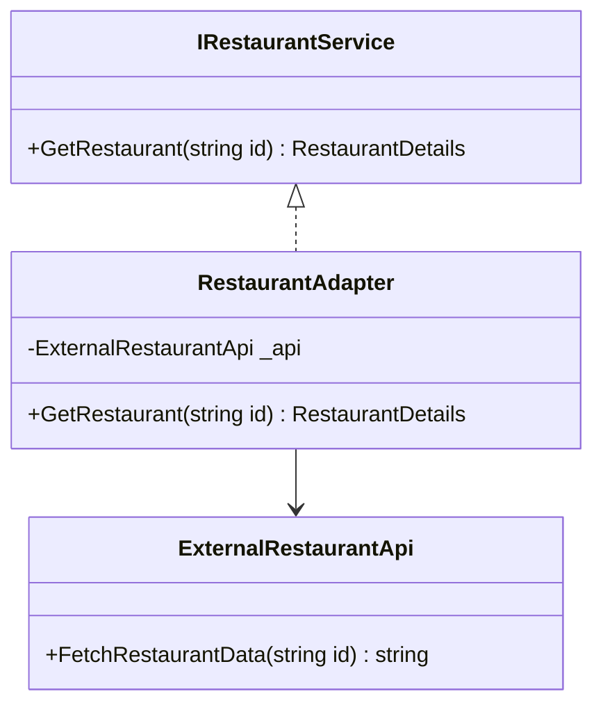

👉 **Uso real**: integração com APIs externas de restaurantes, pagamentos ou logística.

---

## 🌉 2. Bridge – Relatórios de pedidos em múltiplos formatos

### 🧠 Contexto

O FoodNow gera relatórios de pedidos (ex: por restaurante, por região, por período), que podem ser exportados em diferentes formatos (PDF, CSV, JSON).

---

### 🧱 Exemplo

```csharp
// Implementor
public interface IReportExporter {
    void Export(string content);
}

// Implementações
public class PdfExporter : IReportExporter {
    public void Export(string content) =>
        Console.WriteLine($"Exportando PDF: {content}");
}

public class CsvExporter : IReportExporter {
    public void Export(string content) =>
        Console.WriteLine($"Exportando CSV: {content}");
}

// Abstraction
public abstract class OrderReport {
    protected IReportExporter _exporter;

    protected OrderReport(IReportExporter exporter) {
        _exporter = exporter;
    }

    public abstract void Generate();
}

// Refined Abstraction
public class RestaurantOrderReport : OrderReport {
    public RestaurantOrderReport(IReportExporter exporter)
        : base(exporter) { }

    public override void Generate() {
        var content = "Relatório de pedidos por restaurante";
        _exporter.Export(content);
    }
}
```

---

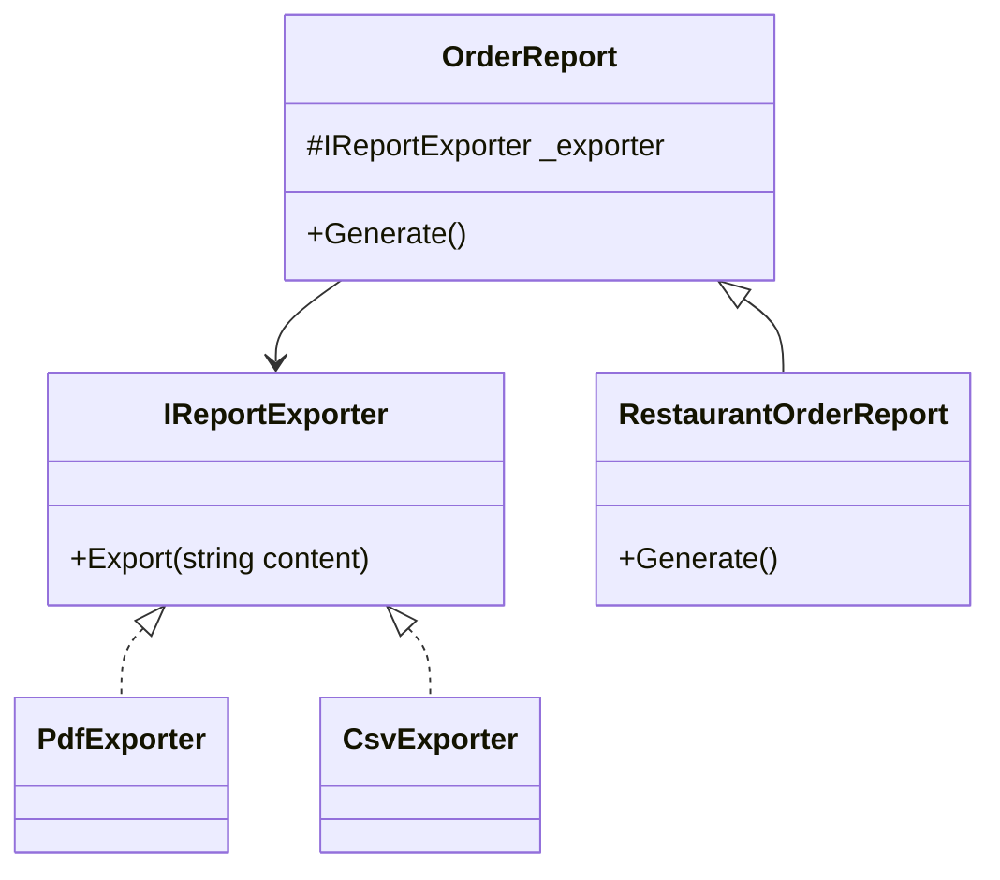

👉 **Uso real**: relatórios administrativos, dashboards e exportação de dados.

---

## 🌲 3. Composite – Estrutura de itens de um pedido

### 🧠 Contexto

Um pedido no FoodNow pode conter:

* itens individuais
* combos (ex: menu com bebida + acompanhamento)

Ou seja, temos uma estrutura hierárquica.

---

### 🧱 Exemplo

```csharp
// Component
public abstract class OrderItem {
    public abstract decimal GetPrice();
}

// Leaf
public class SimpleItem : OrderItem {
    private readonly decimal _price;

    public SimpleItem(decimal price) {
        _price = price;
    }

    public override decimal GetPrice() => _price;
}

// Composite
public class ComboItem : OrderItem {
    private readonly List<OrderItem> _items = new();

    public void Add(OrderItem item) => _items.Add(item);

    public override decimal GetPrice() =>
        _items.Sum(i => i.GetPrice());
}
```

---

```csharp
// Uso
var combo = new ComboItem();
combo.Add(new SimpleItem(10)); // burger
combo.Add(new SimpleItem(5));  // drink

Console.WriteLine($"Total: {combo.GetPrice()}"); // 15
```

---

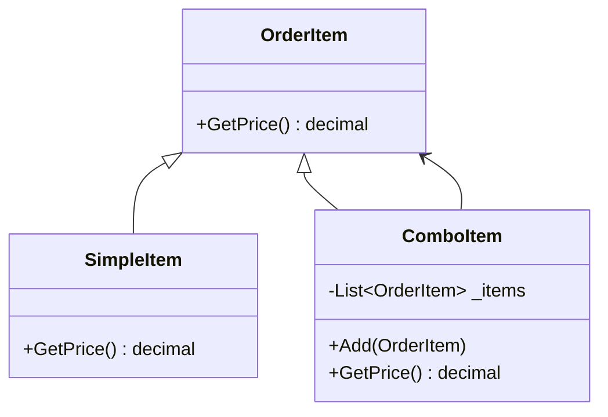

👉 **Uso real**: pedidos com combos, menus e agrupamentos de itens.

---

## 🔐 4. Private Class Data – Proteção de dados do pedido

### 🧠 Contexto

O FoodNow precisa proteger dados sensíveis do pedido:

* valor total
* dados do cliente
* endereço

Esses dados não devem ser alterados diretamente.

---

### 🧱 Exemplo

```csharp
// Dados privados
public class OrderData {
    public string Customer { get; }
    public decimal Total { get; }
    public string Address { get; }

    public OrderData(string customer, decimal total, string address) {
        Customer = customer;
        Total = total;
        Address = address;
    }
}

// Classe principal
public class Order {
    private readonly OrderData _data;

    public Order(string customer, decimal total, string address) {
        _data = new OrderData(customer, total, address);
    }

    public string GetCustomer() => _data.Customer;
    public decimal GetTotal() => _data.Total;

    public string GetMaskedAddress() =>
        $"*** {_data.Address[^5..]}";
}
```

---

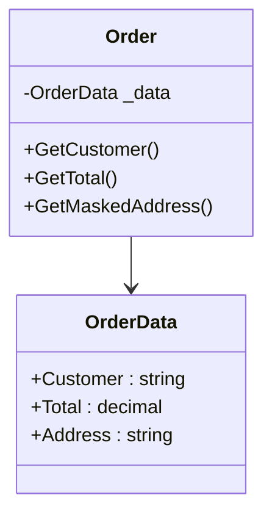

👉 **Uso real**:

* proteger dados do cliente
* garantir imutabilidade
* evitar alterações indevidas

---

## 🧠 Resumo

| Padrão             | Uso no FoodNow                    |
| ------------------ | --------------------------------- |
| Adapter            | Integração com APIs externas      |
| Bridge             | Relatórios com múltiplos formatos |
| Composite          | Combos e pedidos compostos        |
| Private Class Data | Proteção de dados sensíveis       |


</details>

---
## Referências

- https://sourcemaking.com/design_patterns/structural_patterns

## Boas Práticas

- Exemplo uso de quality rules com .editorconfig: https://learn.microsoft.com/en-us/dotnet/fundamentals/code-analysis/quality-rules/

- Library para trabalhar com Office: https://learn.microsoft.com/en-us/office/open-xml/open-xml-sdk

---
  > © MoOngy 2026 | Este repositório é parte do programa de formação contínua em Engenharia de Software.
