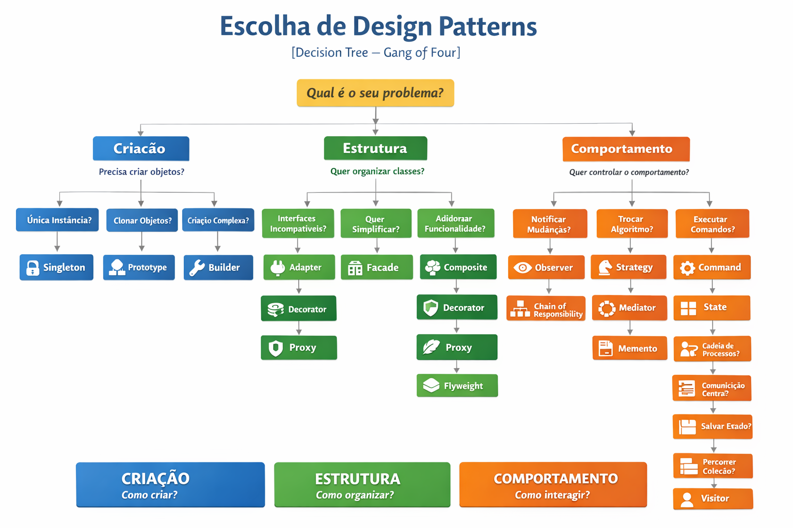

### 📘 **Sessão 11 – Padrões Arquiteturais em Sistemas Modernos**

📅 **Data:** 16/07/2025
⏱ **Duração:** 2 horas
🎯 **Objetivo da Sessão:**
Compreender os princípios e aplicações práticas dos principais padrões arquiteturais modernos: **Domain-Driven Design (DDD)**, **Arquitetura em Camadas**, e **Arquitetura de Microsserviços**, com foco em suas vantagens, limitações e quando utilizá-los.

---

## 🧩 Estrutura da Aula

| **Momento**                                          | **Conteúdos Programáticos**                                                                       | **Metodologia**                                                            | **Técnicas e Instrumentos de Avaliação**                                        | **Tempo** |
| ---------------------------------------------------- | ------------------------------------------------------------------------------------------------- | -------------------------------------------------------------------------- | ------------------------------------------------------------------------------- | --------- |
| **1. Introdução**                                    | Visão geral de padrões arquiteturais modernos                                                     | Expositivo com uso de slides                                               | Pergunta disparadora: “Qual padrão arquitetural você usa ou já viu na prática?” | 10 min    |
| **2. DDD - Domain-Driven Design**                    | Conceitos-chave: Ubiquitous Language, Bounded Context, Entities, Value Objects, Aggregates        | Aula dialogada com quadro ou Miro + estudo de caso simples                 | Mini quiz ao final + discussão de onde aplicar                                  | 30 min    |
| **3. Arquitetura em Camadas (Layered Architecture)** | Apresentação das camadas (Apresentação, Aplicação, Domínio, Infraestrutura) + Boas práticas       | Demonstração com diagrama + comparação com arquitetura monolítica clássica | Atividade: identificar as camadas em um exemplo conhecido (ex: app bancário)    | 20 min    |
| **4. Microsserviços (Microservices Architecture)**   | Princípios: Independência, Deploy isolado, Escalabilidade, Comunicação via API/filas              | Exposição com animações + debate prós/cons                                 | Discussão em grupos: "Quando *não* usar microsserviços?"                        | 30 min    |
| **5. Comparativo e Integração dos Padrões**          | Como os 3 padrões podem coexistir (ex: DDD aplicado em microsserviços com arquitetura em camadas) | Apresentação de um diagrama integrador + estudo de um cenário real         | Participação em grupo + perguntas abertas                                       | 15 min    |
| **6. Conclusão e Encerramento**                      | Recapitulação + leitura complementar e desafios                                                   | Gamificação (Kahoot ou Mentimeter)                                         | Feedback rápido da sessão + QR code para material complementar                  | 15 min    |

---

## 📎 Material Complementar

* Livro: *Domain-Driven Design* – Eric Evans (ou versão light: *Implementing DDD* – Vaughn Vernon)
* Artigo: “Monolith vs Microservices” – Martin Fowler
* Repositório com exemplos de projeto DDD com camadas e microsserviços (pode ser adaptado ao seu stack preferido)
* https://learn.microsoft.com/en-us/dotnet/architecture/microservices/
* https://learn.microsoft.com/pt-br/dotnet/architecture/microservices/microservice-ddd-cqrs-patterns/ddd-oriented-microservice
* https://learn.microsoft.com/en-us/azure/architecture/patterns/
* https://learn.microsoft.com/en-us/assessments/
* https://www.entityframeworktutorial.net/efcore/entity-framework-core.aspx

---
  > © MoOngy 2026 | Este repositório é parte do programa de formação contínua em Engenharia de Software.
