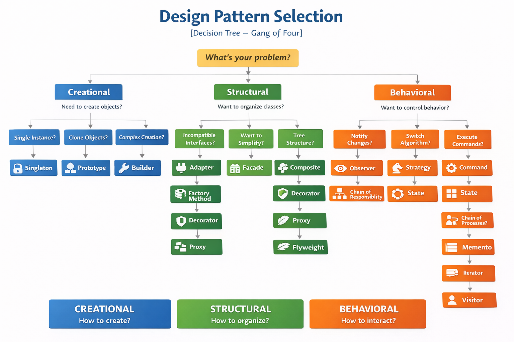

### 📘 **Sessão 11 – Padrões Arquiteturais em Sistemas Modernos**

📅 **Data:** 15/04/2026
⏱ **Duração:** 2 horas
🎯 **Objetivo da Sessão:**
Compreender os princípios e aplicações práticas dos principais padrões arquiteturais modernos: **Domain-Driven Design (DDD)**, **Arquitetura em Camadas**, e **Arquitetura de Microsserviços**, com foco em suas vantagens, limitações e quando utilizá-los.


---

# 🌳 Decision Tree – Escolha de Design Patterns (GoF)



## 🧭 PASSO 1 — Qual é o problema principal?

```
👉 Você está lidando com:
A) Criação de objetos?
B) Estrutura/organização?
C) Comportamento/interação?
```

---

# 🏗️ A) CREATIONAL

## 👉 Precisa controlar como objetos são criados?

```
→ Só pode existir UMA instância?
   ✅ Singleton

→ Precisa CLONAR objetos existentes?
   ✅ Prototype

→ Criação é complexa (muitos passos)?
   ✅ Builder

→ Quer delegar criação para subclasses?
   ✅ Factory Method

→ Precisa criar famílias de objetos relacionados?
   ✅ Abstract Factory
```

💡 **Resumo mental rápido:**

* complexidade → Builder
* variação → Factory
* famílias → Abstract Factory
* instância única → Singleton
* cópia → Prototype

---

# 🧱 B) STRUCTURAL

## 👉 Problema é organizar ou integrar classes?

```
→ Interfaces incompatíveis?
   ✅ Adapter

→ Quer simplificar um sistema complexo?
   ✅ Facade

→ Precisa adicionar comportamento sem alterar classe?
   ✅ Decorator

→ Estrutura em árvore (parte-todo)?
   ✅ Composite

→ Separar abstração da implementação?
   ✅ Bridge

→ Quer controlar acesso ao objeto?
   → Controle simples?
       ✅ Proxy

→ Precisa economizar memória com muitos objetos?
   ✅ Flyweight
```

💡 **Resumo mental:**

* integrar → Adapter
* simplificar → Facade
* estender → Decorator
* hierarquia → Composite
* desacoplar → Bridge
* controlar acesso → Proxy
* otimizar memória → Flyweight

---

# 🔄 C) BEHAVIORAL

## 👉 Problema é comunicação ou comportamento?

```
→ Quer notificar múltiplos interessados automaticamente?
   ✅ Observer

→ Quer trocar algoritmo em runtime?
   ✅ Strategy

→ Quer encapsular uma ação/comando?
   ✅ Command

→ Comportamento muda com estado interno?
   ✅ State

→ Passar requisição por uma cadeia?
   ✅ Chain of Responsibility

→ Centralizar comunicação entre objetos?
   ✅ Mediator

→ Precisa salvar/restaurar estado?
   ✅ Memento

→ Quer definir esqueleto de algoritmo com variações?
   ✅ Template Method

→ Precisa percorrer coleção sem expor estrutura?
   ✅ Iterator

→ Quer adicionar comportamento sem modificar classes?
   ✅ Visitor
```

💡 **Resumo mental:**

* eventos → Observer
* algoritmos → Strategy
* ações → Command
* estado → State
* pipeline → Chain
* orquestração → Mediator
* histórico → Memento
* template → Template Method
* coleção → Iterator
* extensão sem tocar código → Visitor

---

# 🧠 SUPER RESUMO 

```
CRIAÇÃO → como nasce?
ESTRUTURA → como organiza?
COMPORTAMENTO → como interage?
```

---

# 💥 Versão "FoodNow" (pra dar aquele brilho)

* Pedido muda status → **State**
* Notificação ao cliente → **Observer**
* Cálculo de frete → **Strategy**
* Integração com gateway → **Adapter + Facade**
* Criação de pedido complexo → **Builder**
* Pipeline de validação → **Chain of Responsibility**

---

# ⚠️ Dica de arquiteto (essa aqui vale ouro)

Essa árvore **não é linear na vida real**. Às vezes:

* você começa com **Strategy**
* percebe acoplamento → entra **Factory**
* depois simplifica → adiciona **Facade**

👉 **Patterns são combináveis**, não exclusivos.

---

## 🧩 Estrutura da Aula

| **Momento**                                          | **Conteúdos Programáticos**                                                                       | **Metodologia**                                                            | **Técnicas e Instrumentos de Avaliação**                                        | **Tempo** |
| ---------------------------------------------------- | ------------------------------------------------------------------------------------------------- | -------------------------------------------------------------------------- | ------------------------------------------------------------------------------- | --------- |
| **1. Introdução**                                    | Visão geral de padrões arquiteturais modernos                                                     | Expositivo com uso de slides                                               | Pergunta disparadora: “Qual padrão arquitetural você usa ou já viu na prática?” | 10 min    |
| **2. DDD - Domain-Driven Design**                    | Conceitos-chave: Ubiquitous Language, Bounded Context, Entities, Value Objects, Aggregates        | Aula dialogada com quadro ou Miro + estudo de caso simples                 | Mini quiz ao final + discussão de onde aplicar                                  | 30 min    |
| **3. Arquitetura em Camadas (Layered Architecture)** | Apresentação das camadas (Apresentação, Aplicação, Domínio, Infraestrutura) + Boas práticas       | Demonstração com diagrama + comparação com arquitetura monolítica clássica | Atividade: identificar as camadas em um exemplo conhecido (ex: app bancário)    | 20 min    |
| **4. Microsserviços (Microservices Architecture)**   | Princípios: Independência, Deploy isolado, Escalabilidade, Comunicação via API/filas              | Exposição com animações + debate prós/cons                                 | Discussão em grupos: "Quando *não* usar microsserviços?"                        | 30 min    |
| **5. Comparativo e Integração dos Padrões**          | Como os 3 padrões podem coexistir (ex: DDD aplicado em microsserviços com arquitetura em camadas) | Apresentação de um diagrama integrador + estudo de um cenário real         | Participação em grupo + perguntas abertas                                       | 15 min    |
| **6. Conclusão e Encerramento**                      | Recapitulação + leitura complementar e desafios                                                   | Gamificação (Kahoot ou Mentimeter)                                         | Feedback rápido da sessão + QR code para material complementar                  | 15 min    |

---

## 📎 Material Complementar

* Livro: *Domain-Driven Design* – Eric Evans (ou versão light: *Implementing DDD* – Vaughn Vernon)
* Artigo: “Monolith vs Microservices” – Martin Fowler
* Repositório com exemplos de projeto DDD com camadas e microsserviços (pode ser adaptado ao seu stack preferido)
* https://learn.microsoft.com/en-us/dotnet/architecture/microservices/
* https://learn.microsoft.com/pt-br/dotnet/architecture/microservices/microservice-ddd-cqrs-patterns/ddd-oriented-microservice
* https://learn.microsoft.com/en-us/azure/architecture/patterns/
* https://learn.microsoft.com/en-us/assessments/
* https://www.entityframeworktutorial.net/efcore/entity-framework-core.aspx


---
  > © MoOngy 2026 | Este repositório é parte do programa de formação contínua em Engenharia de Software.
